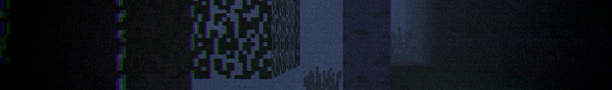
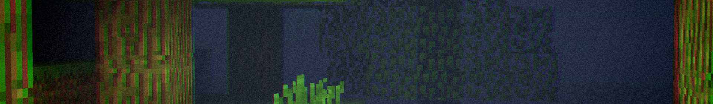

# Somber

Somber is a light weight Iris minecraft shaderpack that aims to bring back the atmosphere of earlier versions of minecraft with added eerie effects.

**It is recommended to use the built-in *Programmer Art* texture pack to bring back old textures.**

## Effects

Most effects can be toggled and customized in the settings menu for the shader including
- Vignette
- Vignette Strength
- Chromatic Aberration
- Aberration Strength
- Noise
- Noise Strength
- Fog
- Fog Strength
- Fog Sky Overlay
- Water Transparency
- Water Vibrance Strength
- Old Foliage Vibrance
- Foliage Vibrance Strength
- Star Brightness
- Sun and Moon Brightness

The shader also accentuates shadows similarly to old versions, adds dynamic fog which darkens with depth, and removes transparency from the top water layers so you can't see what's below.

